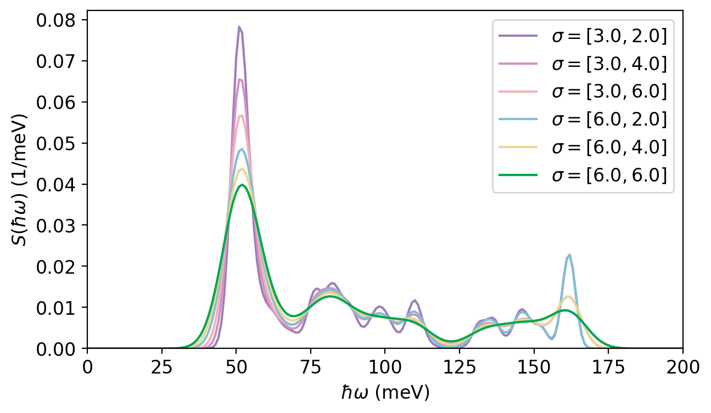
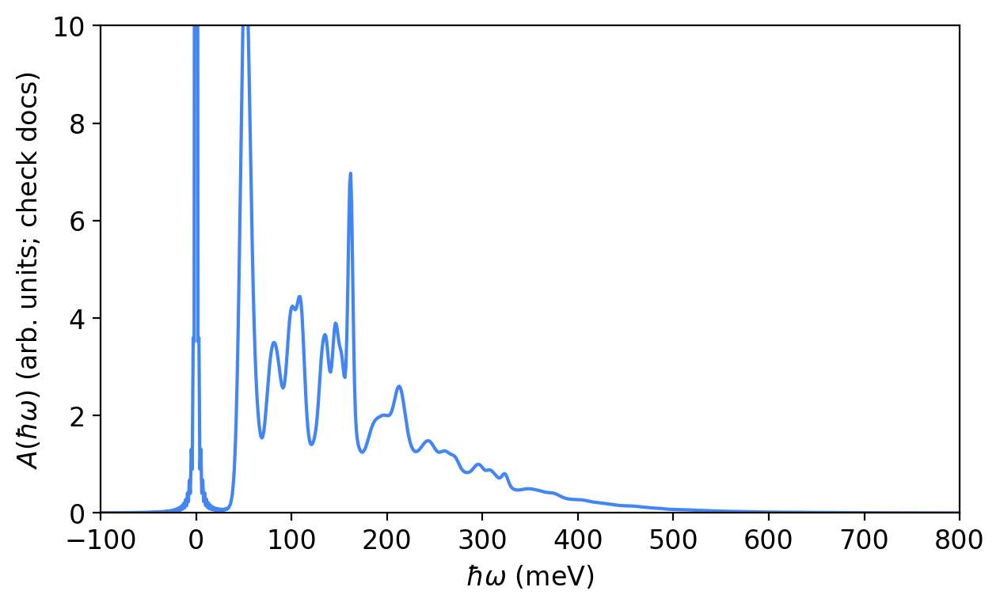
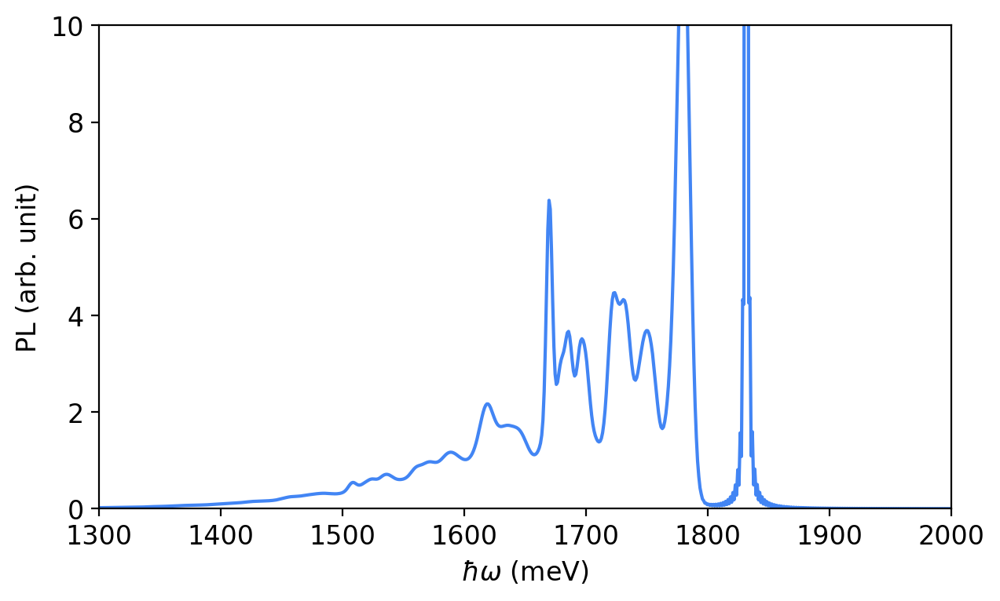
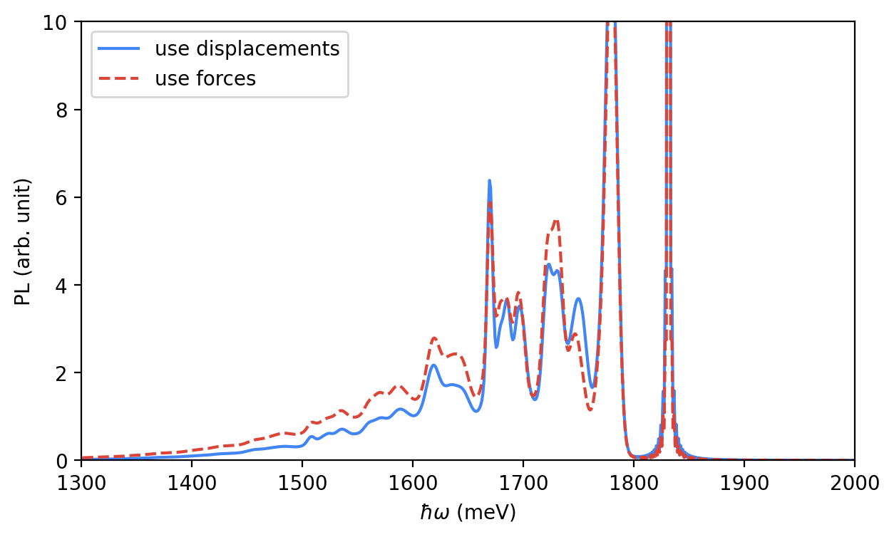
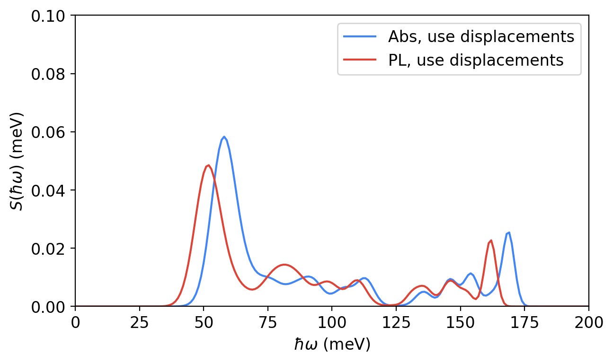
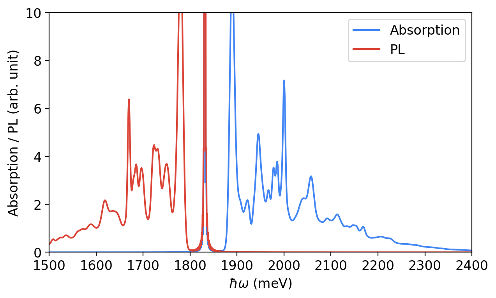
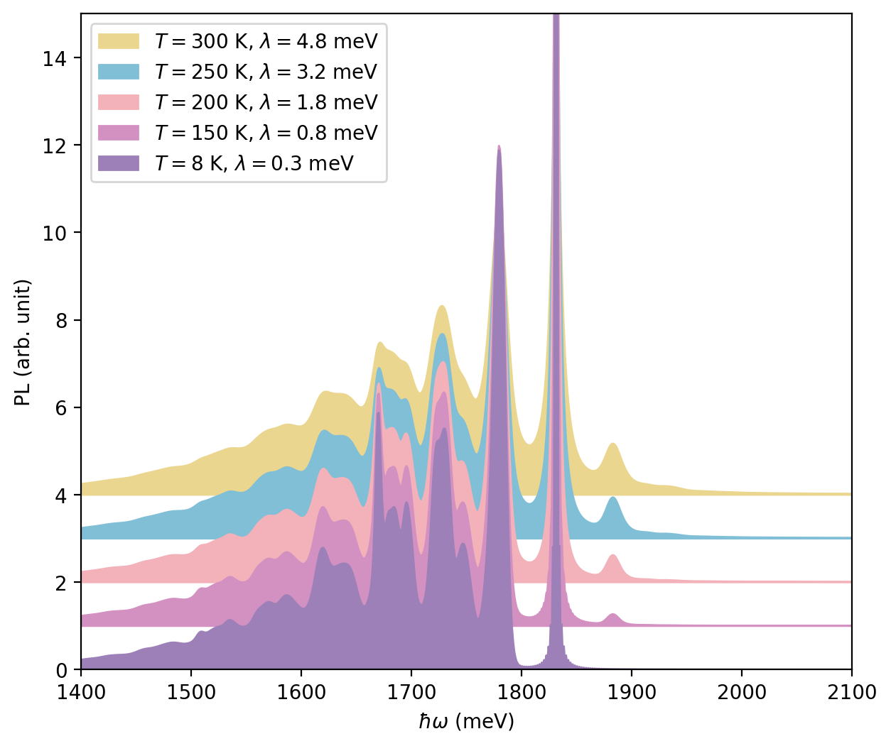

See all of the images below:

Here is a clean, ready-to-copy **README.md** that displays *all of your plots* with clear titles and image links.

---

# 📊 NV Center – Generated Spectra and Analysis Plots

This directory contains all plots generated from the NV-center phonon, absorption, and photoluminescence workflow. Each image is displayed below with its corresponding name.

---

## **1. Spectral Density**

**File:** `spectral_density.png`
Shows the phonon spectral density ( J(\omega) ), describing how strongly each phonon mode couples to the electronic transition.

---

## **2. Lineshape Function**

**File:** `lineshape_function.png`
Plots the total PL lineshape computed using the Huang–Rhys factors and convolution with broadening functions.

---

## **3. Photoluminescence (PL) Spectrum**

**File:** `pl_spectrum.png`
Shows the computed PL spectrum, including the zero-phonon line (ZPL) and phonon-sideband contributions.

---

## **4. PL Forces**

**File:** `pl_forces.png`
Visualizes the mode-projected forces between ground-state and excited-state geometries, used to compute Huang–Rhys factors.

---

## **5. Absorption Spectrum**

**File:** `abs_spectrum.png`
Shows the calculated optical absorption spectrum based on excited-state phonon modes.

---

## **6. Photoluminescence Absorption Comparison**

**File:** `pl_absorption.png`
A combined plot illustrating the relationship between PL and absorption spectra.

---

## **7. Time-Domain Photoluminescence**

**File:** `td_pl.png`
Displays the time-domain PL response obtained from the Fourier transform of the lineshape function.

---

Let me know if you want this automatically generated by a Python script, or if you want descriptions expanded with more physics background!
