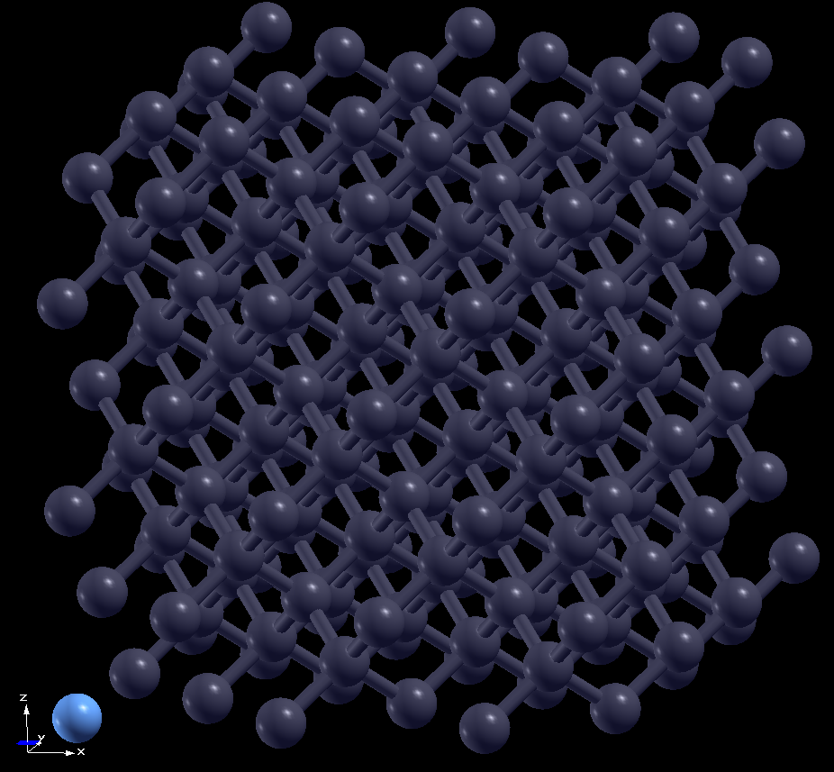

# NV-center-diamond
NV center in diamond calculations using [ASE](https://ase-lib.org/), [QE](https://www.quantum-espresso.org/), and [WEST](https://west-code.org/).

### Overview

This project models the negatively charged nitrogen-vacancy (NV⁻) center in diamond — a point defect formed by substituting one carbon atom with nitrogen and removing a neighboring carbon atom. The NV⁻ center exhibits unique electronic and spin properties, making it a leading system for quantum sensing and quantum information applications (see:[ https://doi.org/10.1038/s41578-021-00306-y]( https://doi.org/10.1038/s41578-021-00306-y), [https://doi.org/10.1103/PhysRevB.74.104303](https://doi.org/10.1103/PhysRevB.74.104303), [https://doi.org/10.1088/1367-2630/13/2/025025](https://doi.org/10.1088/1367-2630/13/2/025025), [https://doi.org/10.1088/1367-2630/13/2/025019](https://doi.org/10.1088/1367-2630/13/2/025019)).

The electronic ground state of NV⁻ is a spin-triplet ³A₂ state, while the lowest optically accessible excited state is another triplet, ³E. The transition between these states gives rise to the zero-phonon line (ZPL) around [1.945 eV](https://doi.org/10.1098/rspa.1976.0039).
In this workflow:

- A DFT relaxation is performed to obtain the ground-state (³A₂) geometry.

- A BFGS TDDFT optimization is then run to find the excited-state (³E) geometry.

- The energy difference between the two relaxed states yields the adiabatic excitation energy, directly related to the ZPL.

### Step 1: build the diamond supercell and then introduce NV center

- use the script in the `build_structure` directory to generate, $2\times2\times2$ (64 atoms) and $3\times3\times3$ (216 atoms) supercells composed of diamond conventional cubic unit cell
- The script uses [ASE (Atomic Simulation Environment)](https://ase-lib.org/)

xz-plane 3x3x3 supercell (visualized using [xcrysden](http://www.xcrysden.org/))

angled 3x3x3 supercell

### Step 2: Quantum Espresso "relaxation" calculation to get GS geometry and GS energy
- Use the provided input file `2x2x2/relax/pw_nv_diamond_relax.in` to see how it is set up.
- A standard QE DFT planewave (PW) calculation is done by submiting `job_script.sh`
- Input files referenced the parameters used by Yu Jin for his calculations in the following paper: 
Yu Jin, Victor Wen-zhe Yu, Marco Govoni, Andrew C. Xu, and Giulia Galli
Journal of Chemical Theory and Computation 2023 19 (23), 8689-8705
DOI: [10.1021/acs.jctc.3c00986](doi.org/10.1021/acs.jctc.3c00986)
  - His data can be found here: 
    - https://notebook.rcc.uchicago.edu/files/arXiv.2309.03513/Datasets/PointDefects/NV-_diamond/PBE_216_Relaxation/

### Step 3: BFGS algorithm to find ES geometry and energies

- The BFGS (Broyden–Fletcher–Goldfarb–Shanno) algorithm is used to relax the excited-state (ES) geometry.

- It iteratively updates atomic positions using forces from the total ES energy (GS energy + excitation energy).
    - [WEST](https://west-code.org/) is used to calculated the excited state energies at each iteration using LR-TDDFT.

- [WESTpy](https://west-code.org/doc/westpy/latest/) calls pw.x and wbse.x at each step to compute these quantities.

- Convergence is reached when total forces and energy changes fall below thresholds.

- The optimized ES structure is used to compute the adiabatic excitation energy (AEE)-- which we use to approximate the zero-phonon line (ZPL) by assuming that the zero point energies are similar in the electronic ground and excited states.
- 
### Step 4: ΔSCF (Delta Self-Consistent Field) Calculation

The ΔSCF method provides an alternative way to compute excitation energies using ground-state DFT.

Instead of relying on the linear-response formalism of TDDFT, ΔSCF explicitly constructs an excited-state configuration by modifying the Kohn–Sham orbital occupations—typically promoting an electron from a filled state to an empty one while conserving spin and total charge.

A new self-consistent DFT calculation is then performed on this excited configuration to allow the charge density to relax in the presence of the excitation.

The excitation energy is obtained as the total energy difference between the excited-state SCF calculation and the ground-state SCF calculation.

This method often provides accurate results for localized excitations, such as the NV⁻ center’s ³A₂ → ³E transition, and serves as a useful benchmark against TDDFT predictions.

### Step 5: Analyze
- run the `2x2x2/analyze.py` script to analyze the data and print out the important values
- the output can be found in `2x2x2/analyze.out`
